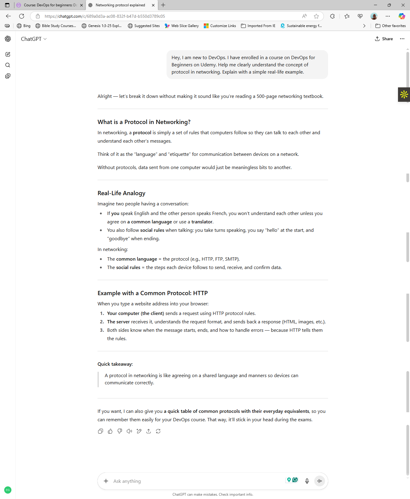
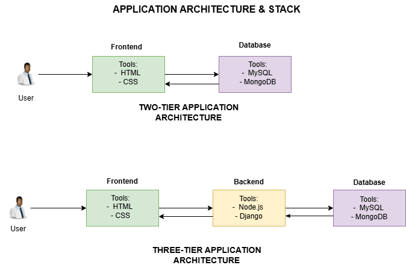
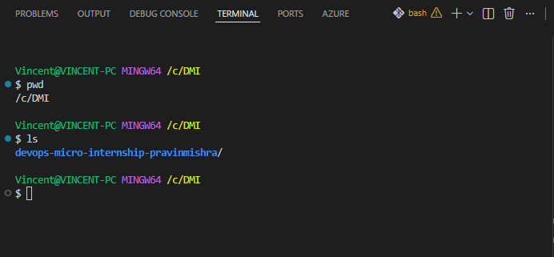

# Week 00 - Internet and Networking

Part of the DevOps Micro Internship (DMI) Cohort 3 with Agentic AI

---

# 🧑‍💻 Task 1: Using ChatGPT as Your Learning Assistant

## Scenario

You're new to DevOps and will frequently encounter technical questions. ChatGPT can be your learning companion.

## Your Task

Write a clear ChatGPT prompt to help you understand:

> "What is a protocol in networking? Explain with a simple real-life example."

Take a screenshot of your interaction showing:

* Your detailed prompt (with clear expectations)
* ChatGPT's simplified response with an example

## Screenshot

Save your screenshot in the `screenshots` folder and update the file name below.




Replace `task-1-chatgpt.png` with your actual screenshot file name.

---


## What I Learned (2–3 lines)

ChatGPT is a great companion in my journey in DMI. With a well crafted prompt, it can provide answers to technical terms and concepts. It's solutions should always be verified for accuracy and  correctness.

---

# 🌐 Task 2: Internet and Networking

## Scenario

Your friend is launching an online bookstore named **EpicReads**.

He asked you to explain how users globally can access his website hosted in Finland.

## Your Task

Write a short explanation (**100–150 words**) that includes:

* Packet Switching
* IP Address
* TCP/IP
* HTTP/HTTPS

💡 **Tip:** You may use ChatGPT (as demonstrated in Task 1) to refine your explanation.

## Answer

When a US user visits EpicReads (hosted in Finland), his computer sends a request over the internet using packet switching. Packet switching means breaking the data into small packets which travel through several routes and reassemble at the destination. The request is sent to the IP Address of the Finnish server. The IP Address is just like a house address for computers. Communication between computers follows a set of rules - the TCP/IP. The TCP ensures all packets arrive in order and complete, and the IP handles the addressing and delivery. 

Once the server gets the request, it responds using HTTP or HTTPS - the set of rules for web pages. HTTPS adds encryption to the transmission, making it secure. Finally, the user’s browser displays the bookstore’s page. This is just like receiving a letter across the world, piece by piece, in seconds.


---

# 🏗️ Task 3: Application Architecture & Stack

## Scenario

EpicReads bookstore has two application versions:

### Two-Tier Application

* Frontend
* Database

### Three-Tier Application

* Frontend
* Backend
* Database

## Your Task

* Draw simple diagrams (hand-drawn or tool-based such as draw.io)
* Label each layer clearly
* List at least two common technologies or tools used for each layer
* Submit a screenshot or photo clearly showing your own drawing

## Diagram Screenshot / Photo

Save your diagram image in the `screenshots` folder and update the file name below.




Replace `task-3-diagram.png` with your actual diagram file name.

---

## Technologies Used

### Frontend

* HTML
* CSS

### Backend

* Node.js
* Django

### Database

* MySQL
* MongoDB

---

# 🌍 Task 4: Domain Name & DNS (Basic Concepts)

## Scenario

Your friend's bookstore **EpicReads** is currently accessible through:

```text
52.172.142.222:3000
```

He purchased the domain:

```text
epicreads.com
```

## Your Task

In **50–100 words**, explain in your own words:

1. What is DNS (Domain Name System)?
2. Which DNS record type should be used to connect the domain to the given IP, and why?

## Answer

The Domain Name System (DNS) translates human-readable names (epicreads.com) into an IP Address (like 52.172.142.222:3000) so that browsers can find the right server. It is therefore the internet’s phonebook. To connect the domain to the given IP Address, my friend should use an A record. This record maps a domain name directly to an IPv4 address. Hence, users can access the bookstore without typing the IP Address and port.

---

# 💻 Task 5: Visual Studio Code Setup (Hands-on)

## Your Task

Install Visual Studio Code (if not already installed).

Take a screenshot of your VS Code environment showing:

* Terminal open inside VS Code
* Running a basic command:

### Windows

```powershell
dir
```

### Linux / macOS

```bash
pwd
ls
```

* Your selected VS Code theme clearly visible

⚠️ **Important:** The screenshot must show your username or another identifiable detail to confirm it is your environment.

## Screenshot

Save your screenshot in the `screenshots` folder and update the file name below.




Replace `task-5-vscode.png` with your actual screenshot file name.

---

# 🔗 Task 6: Publish Your Assignment as a LinkedIn Post

## Objective

Publishing on LinkedIn helps you:

* Build your professional online presence
* Reinforce your learning
* Document your DevOps journey publicly

## Your Task

Summarize your answers from Tasks 1–5 into a LinkedIn post.

Clearly structure your post into the following sections:

* ChatGPT
* Internet & Networking
* App Architecture
* DNS
* VS Code Setup

Add the following credit note at the end of your post:

> **P.S. This post is part of the DevOps Micro Internship (DMI) with Agentic AI — Cohort 3 — by Pravin Mishra. My graded progress is public: https://dmi.pravinmishra.com/s/YOUR-GITHUB-USERNAME.html · Start your DevOps journey: https://dmi.pravinmishra.com/?utm_source=student&utm_medium=ps-linkedin&utm_campaign=cohort3**

---

## LinkedIn Post URL

Paste your LinkedIn post URL here:

```text
https://www.linkedin.com/posts/egwu-oko_devops-for-beginners-docker-k8s-cloud-activity-7360795994587897856-xOuV?utm_source=share&utm_medium=member_desktop&rcm=ACoAAEw2bJAB3kAupCs3BrMdP2uO4qDEMg0CtSs
```

---

## LinkedIn Post Backup Copy

Paste the full text of your LinkedIn post here:

Having graduated from DMI Cohort 1, I am thrilled to be undertaking the self-paced track of the DevOps Micro Internship (DMI) with Agentic AI — Cohort 3 — by Pravin Mishra.

The Week 0 (Introduction) provided me with an opportunity to have a clearer understanding of how the internet works, networking, and basic tools for DevOps.

At this introductory level, I carried out the following tasks.

👉 Using ChatGPT as a Learning Assistant
I have understood how to prompt ChatGPT to help me understand technical concepts. ChatGPT is now my learning companion.

👉 Internet and Networking 
I now have a better understanding of how the internet and networking work. A friend of mine interested in launching an online bookstore - EpicReads wanted an explanation on how US users can access his website hosted in Finland.
Getting curious? Here is my simple explanation.

When a US user visits EpicReads in Finland, their computer sends a request via packet switching, breaking data into packets that travel different routes and reassemble at the destination. The request goes to the server’s IP address (like a house address), using TCP/IP for reliable delivery and addressing. The server responds via HTTP/HTTPS, with HTTPS adding encryption. The browser then displays the bookstore’s page, much like receiving a letter from across the world in seconds.

👉 Application Architecture and Stack
EpicReads bookstore has two application versions.
a. Two-Tier Application - consisting of the frontend and the database
b. Three-Tier Application - consisting of the frontend, backend, and database.
The frontend lets users interact with the app using technologies like HTML, CSS, and JavaScript. The backend handles business logic with tools such as Python and Node.js, communicating with the frontend. The database stores data using systems like MySQL and MongoDB.

👉 Domain Name and DNS (Basic Concepts)
My friend purchased the domain "epicreads.com" and wants to know what DNS is and what DNS record he should use to connect his domain to the IP Address.

Here is my simple answer.

The Domain Name System (DNS) translates human-readable names (like epicreads.com) into an IP Address (like 52.172.142.222) so that browsers can find the right server. It is therefore the internet's phonebook. To connect the domain to the IP Address, he should use an A record.

👉 Visual Studio Code Setup
I successfully downloaded and set up my VS Code environment for the tasks ahead.

hashtag#DevOps 
hashtag#AWS 
hashtag#DevOps for beginners

P.S. This post is part of the DevOps Micro Internship (DMI) with Agentic AI — Cohort 3 — by Pravin Mishra. My graded progress is public: https://lnkd.in/e_AT7QxG · Start your DevOps journey: https://lnkd.in/eBFJtRPf

---

# Reflection – Week 0

### What did you find easy?

All the tasks are quite easy

---

### What was difficult?

There's no task difficult for me.

---

### What will you improve next week?

I will have to work more on AI prompting

---

## 📌 About DMI & CloudAdvisory

DevOps Micro Internship (DMI) is a project-based DevOps program run by Pravin Mishra (The CloudAdvisory) focused on real-world execution, systems thinking, and career readiness.

It helps learners build strong DevOps foundations with hands-on experience.


## 📌 Resources

- 🌐 **DMI Official Website:** https://dmi.pravinmishra.com?utm_source=github&utm_medium=readme  
- 🎓 **University:** https://university.pravinmishra.com?utm_source=github&utm_medium=readme  
- 💬 **Discord Community:** https://discord.pravinmishra.com?utm_source=github&utm_medium=readme  
- 📝 **Blog:** https://dmi.pravinmishra.com/blog?utm_source=github&utm_medium=readme  
- ▶️ **YouTube Playlist (DMI Cohort 3):** https://www.youtube.com/playlist?list=PLFeSNDtI4Cho  
- 🔗 **Pravin Mishra (LinkedIn):** https://www.linkedin.com/in/pravin-mishra-aws-trainer/  
- 🏢 **CloudAdvisory (LinkedIn):** https://www.linkedin.com/company/thecloudadvisory/

---

*This submission is part of DevOps Micro Internship (DMI) Cohort 3 — Agentic AI Track*