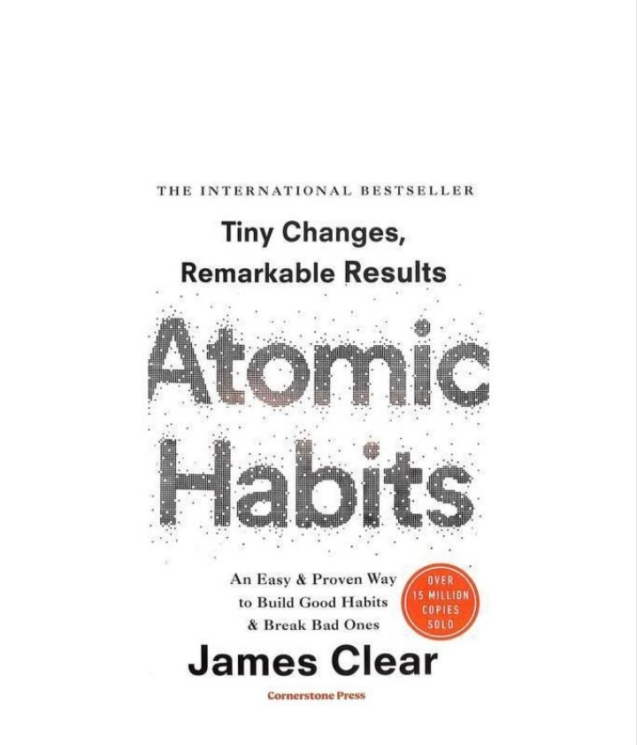
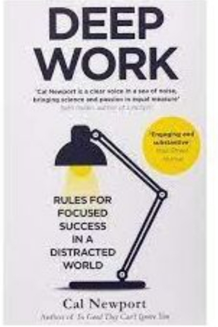
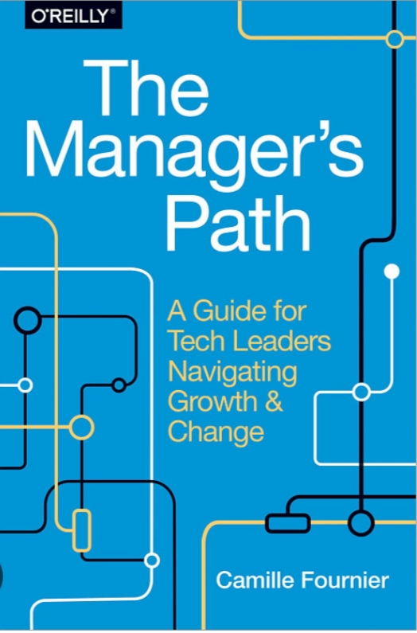
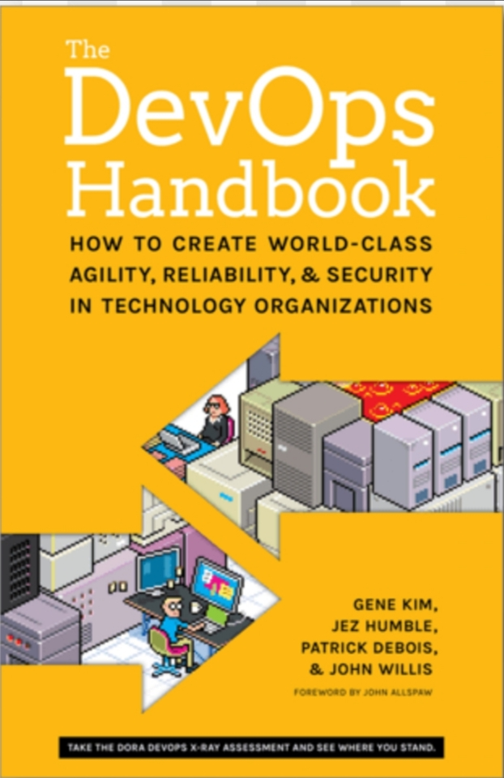
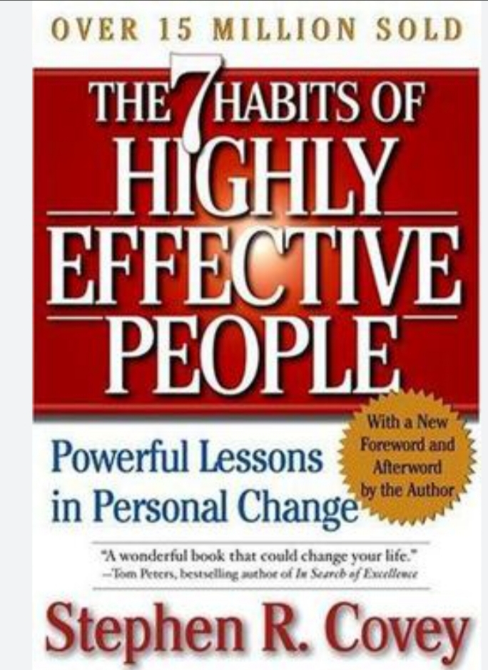
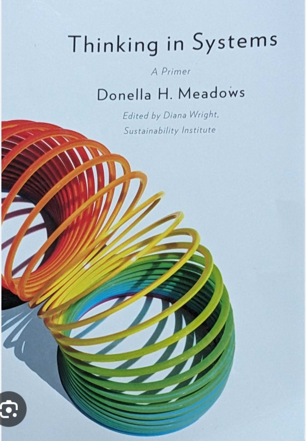
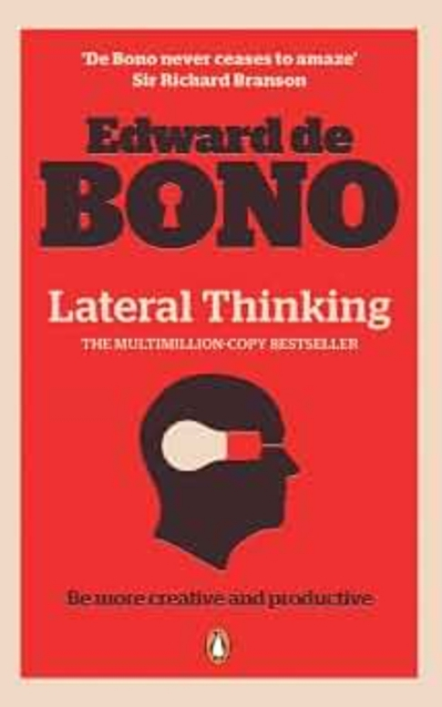

# Week 01 — Success Mindset (Mindset OS)

Part of the DevOps Micro Internship (DMI) Cohort 3 with Agentic AI

---

## Purpose (Read This First)

This week is not motivation homework.

This is you building your **Mindset OS** — the system you will use for the next 5 months (and honestly, for years).

### Expectations

* Be honest.
* Be specific.
* Be practical.
* Write like an adult professional: clear sentences, no one-liners.

You will reuse this in later weeks. So do it properly once.

---

# Assignment 1. What is something you believe to be true that most people around you would disagree with?

### Rules

* No "safe" answers.
* Must be your real belief (not copied from internet).
* Minimum 50 words.

**Hint:** What do you believe about career, money, learning, discipline, relationships, health, success, life, tech industry, etc. that most people don't agree with?

## Answer

I believe real progress comes from hard work, accountability, and shared effort. Money is only a tool, commitments are meant to be honored, and no one succeeds alone. In a world that often celebrates shortcuts and individualism, I stand by the idea that character, responsibility, and collabration matter more than convenience.

I have always believed in giving myself strict guradrails in order not to derail my focus in my chosen life endeavour. Diligent consistency produces expected results. Time is a tool which must be managed diligently to build consistency. I also believe that success doesn't come by mere chance or empty wishes but by a well orchestrated commitment to hardwork, consistency, and time management. 

I usually work my way through pain, patience, and planned investment in time and money for compounded gratification in the future. I must always give my best at all times to ensure the highest quality of work without cutting corners.

---

# Assignment 2. What are the top 3 objective truths you discovered through experimentation and results?

### Definition

Objective truths do not depend on opinions. They hold true regardless of how people feel.

Write each truth in this format:

**Truth:** (1 sentence)

**Evidence from my life:** (2–4 lines: what you tried + what happened)

---

## Truth #1

### Truth

Systems behave differently under pressure

### Evidence from my life

I test my schedule during busy periods and not just calm ones. I organize my workspace and set boundaries to avoid bottlenecks. This has helped me build realistics routines

---

## Truth #2

### Truth

Small daily optimizations compound over time

### Evidence from my life

I review my routines weekly and remove areas of friction. The small weekly improvements simplify my work making it smoother, faster, and less error-prone

---

## Truth #3

### Truth

Self-awareness beats blind reaction

### Evidence from my life

I track what matters to me such as my mood, sleep, spending, or productivity instead of waiting for problems to come come up. This is made possible through weekly reviews or reflection time. This helps me make better decisions as early signs of burnout are noticed.

---

# Assignment 3. What does your 2.0 version look like?

### Instructions

Write as if a journalist is writing about you **3 to 7 years from now** (not 20 years).

**Minimum 300 words.**

### Rules

* Write in past tense, like it already happened.
* Don't use "likes to / wants to / hopes to."
* Use specifics:

  * built
  * shipped
  * led
  * published
  * earned
  * relocated
  * contributed
* Include skills proof:

  * projects
  * portfolios
  * GitHub
  * blogs
  * certifications
  * job role
  * leadership
  * community contribution
* Add 1–3 images if you can (optional but powerful).

### Publish It Publicly On Any ONE

* LinkedIn
* Medium
* WordPress
* Blogspot
* Personal blog
* Portfolio page

Include this line:

> **P.S. This post is part of the DevOps Micro Internship (DMI) with Agentic AI — Cohort 3 — by [Pravin Mishra](https://www.linkedin.com/in/pravin-mishra-aws-trainer/). My graded progress is public: https://dmi.pravinmishra.com/s/YOUR-GITHUB-USERNAME.html · Start your DevOps journey: https://dmi.pravinmishra.com/?utm_source=student&utm_medium=ps-blog&utm_campaign=cohort3**

## Your Article

Egwu Oko: The DevOps Engineer Who Quietly Rewrote the Reliability Story of West Africa’s Digital Economy

By the early 2030s, Egwu had emerged as one of the defining DevOps voices in Nigeria’s rapidly expanding technology sector. His ascent wasn’t loud or self-promotional; it was built on the kind of evidence that industry observers pay attention to—systems he architected, pipelines he shipped, outages he prevented, and communities he strengthened.
A Career Built on Infrastructure, Not Intuition
Between 2026 and 2033, Egwu relocated from Ebonyi State to a regional tech hub where he joined a mid-sized engineering organization undergoing a painful transition to cloud-native operations. What followed was a period of intense transformation. Egwu became one of the engineers responsible for stabilizing the company’s infrastructure and modernizing its deployment culture.
By 2029, he had earned a senior DevOps role, overseeing reliability engineering across multiple product teams. Colleagues often credited him with bringing discipline to environments that had previously relied on improvisation.

The Systems That Defined His Work
Egwu’s impact was measurable. He built and shipped several core systems that reshaped the company’s engineering velocity:
•	A GitHub Actions CI/CD pipeline that cut deployment time from 45 minutes to under 7.
•	A Kubernetes microservices platform that lifted uptime from 92% to 99.8%.
•	A Terraform-managed infrastructure-as-code repository that eliminated configuration drift.
•	A Prometheus and Grafana observability stack that reduced MTTR by 63%.
These weren’t abstract achievements—they were systems that executives referenced in quarterly reports and engineers relied on daily.

Proof of Skill in Public Spaces
Egwu’s GitHub profile became a living archive of his engineering philosophy. He contributed Helm charts, Terraform modules, Bash automation scripts, and Docker hardening guides that were adopted by startups across the region. His repositories were consistently documented, tested, and maintained—rare qualities in an ecosystem still maturing in open-source culture.
His writing reinforced this credibility. Over 30 DevOps-focused articles published on Medium, helped demystify cloud-native engineering for beginners. His essays on observability, Kubernetes adoption, and infrastructure automation became reference points for junior engineers entering the field.

Certifications That Matched His Work
Egwu earned certifications that aligned directly with the technologies he deployed:
•	AWS DevOps Engineer Professional
•	Certified Kubernetes Administrator (CKA)
•	HashiCorp Terraform Associate
•	Azure Administrator Associate
•	Linux Foundation System Administrator
These credentials weren’t ornamental; they were practical validations of the systems he built.

Leadership Beyond the Office
By 2029, Egwu had become a recognizable figure in Nigeria’s DevOps community. He led weekly automation workshops, hosted cloud bootcamps, and contributed to open-source documentation for regional developer groups. His mentorship produced tangible results: more than twenty mentees secured DevOps or Cloud Engineering roles, several launched automation projects, and a handful became conference speakers.
His influence extended beyond code. He helped shape a culture of reliability and documentation in a region where engineering teams often struggled with both.

A Signature Achievement
One project stood out. Egwu architected and shipped a multi-region failover system that dramatically reduced downtime during outages. The system saved the company millions in SLA penalties and became a flagship case study in his portfolio. Industry analysts later cited it as one of the most significant reliability upgrades implemented by a mid-sized African tech company during that period.

A Reputation Built on Evidence
By 2033, Egwu’s professional identity was clear. He was a DevOps Engineer who built resilient systems, a leader who elevated engineering culture, a mentor who strengthened community, and a writer who simplified complexity. His portfolio, GitHub contributions, technical essays, and certifications formed a verifiable timeline of growth—proof that his success was earned through consistent, disciplined engineering.

P.S. This post is part of the DevOps Micro Internship (DMI) - Self-Paced Engineer Track — by Pravin Mishra (https://www.linkedin.com/in/pravin-mishra-aws-trainer/). My graded progress is public: https://dmi.pravinmishra.com/s/vincegwu.html · Start your DevOps journey: https://dmi.pravinmishra.com/?utm_source=student&utm_medium=ps-blog&utm_campaign=cohort3

### Public Link

Paste your link here:

https://www.linkedin.com/posts/egwu-oko_dmi-devops-micro-internship-with-agentic-share-7493673851269312514-MbAB/?utm_source=share&utm_medium=member_desktop&rcm=ACoAAEw2bJAB3kAupCs3BrMdP2uO4qDEMg0CtSs

---

# Assignment 4. Have you ever cut corners (unethical / dishonest / shortcut behavior — not necessarily illegal)? If yes, how did it make you feel?

### Important

You don't need to write the full story.

Focus on the feeling:

* guilt
* fear
* shame
* stress
* regret
* numbness
* etc.

This is about self-awareness, not judgment.

### Answer Format

**Yes / No**

If Yes:

**What emotion did you feel?** (minimum 50–100 words)

## Answer

No

---

# Assignment 5. What are 10 non-fiction books you plan to read in the next 1 year?

### Rules

* Mention **Title + Author**
* Any language allowed
* No fiction novels

### Tip

Choose books that improve:

* mindset
* communication
* productivity
* health
* money
* career
* leadership

## Book List

1. Atomic Habits - James Clear

2. Deep Work - Cal Newport

3. The Manager's Path - Camille Fournier

4. The DevOps Handbook - Gene Kim, Jez Humble, Patrick Debois, John Willis

5. Crucial Conversations - Patterson, Grenny, McMillian, Switzler

6. The 7 Habits of Highly Effective People - Stephen R. Covey

7. Thinking in Systems - Donella Meadows

8. Why We Sleep - Matthew Walker

9. The Psychology of Money - Morgan Housel

10. Lateral Thinking - Camille Fournier

---

# Assignment 6. What are the things you will measure regularly in your life and career?

### Rules

List topics only. No need to share numbers.

### Must Include

* Learning / skill
* Output / proof
* Health / energy
* Time / focus
* Money / finance (personal or business)

### Example

* Learning hours per week
* Deep work sessions per week
* Projects shipped / documented
* Steps / workouts
* Sleep hours
* Spending tracker

## My Metrics

* Tools Learned per Week
* Learning Hours per Week
* Projects shipped per Week
* Teamamtes unblocked per Week
* Hours slept per day
* Deep Work Hours per Week
* Distractions noticed per Week
* Saving made per Month
* Meaningful Conversations per Week
* People helped per Week

---

# Assignment 7. Brain Dump + 5-Month System Plan

## Step 1: Brain Dump (Private)

Do a brain dump of everything in your mind into a notebook.

Examples:

* Bills
* Tasks
* Worries
* Goals
* Pending messages
* Ideas
* Responsibilities

### Did You Do It?

**Yes / No**

Answer:

Yes

---

## Step 2: Your 5-Month Routine + Focus Blocks

Create a simple plan you can realistically follow for the next 5 months.

### Weekly Routine

Example:

* Mon–Thu: 60 min deep work
* Sat: DMI session
* Sun: Weekly review

#### My Weekly Routine

Health and Exercise: Daily Morning

Learning: Tuesday, Thursday, Saturday

Deep Work: Monday, Wednesday

Review and Recovery: Saturday and Sunday

---

### Focus Blocks

#### When Will You Do DMI Work? (Days + Time)

DMI Work: Tuesday (90 minutes), Wednesday (180 minutes)

#### How Many Sessions Per Week?

Two sessions per week

---

### Distraction Rules

Examples:

* Phone rules
* Social media rules
* Environment setup

#### My Distraction Rules

1. Keep phone out of reach during deep work hours
2. Do only one active task at a time
3. Check messages only at regulated times
4. Always clear the desk and close irrelevant tabs before starting work
5. Wait two minutes when you feel the urge to check your phone, social media, or random website.

---

# Reflection – Week 1

### Biggest insight I got about myself this week

The clear need to rejig my mindset for greater productivity and success

### My biggest weakness/loop I noticed

The absence of distraction rules and measurement checklist.

### One system I will implement from this week (exact habit + time)

Weekly Review (Saturdays and Sundays)

### LinkedIn Post

Paste your LinkedIn post link here:

`https://www.linkedin.com/posts/egwu-oko_dmi-devops-micro-internship-with-agentic-share-7493673851269312514-MbAB/?utm_source=share&utm_medium=member_desktop&rcm=ACoAAEw2bJAB3kAupCs3BrMdP2uO4qDEMg0CtSs`

---

## 10. Proof of Work

- LinkedIn Post URL: **https://www.linkedin.com/posts/egwu-oko_dmi-devops-micro-internship-with-agentic-share-7493673851269312514-MbAB/?utm_source=share&utm_medium=member_desktop&rcm=ACoAAEw2bJAB3kAupCs3BrMdP2uO4qDEMg0CtSs**  
- Blog / Medium : **https://medium.com/@egwuoko76/egwu-oko-the-devops-engineer-quietly-rewriting-west-africas-reliability-story-e2366478e94b**  

---

## 📌 About DMI & CloudAdvisory

DevOps Micro Internship (DMI) is a project-based DevOps program run by Pravin Mishra (The CloudAdvisory) focused on real-world execution, systems thinking, and career readiness.

It helps learners build strong DevOps foundations with hands-on experience.

## 📌 Resources

- 🌐 **DMI Official Website:** https://dmi.pravinmishra.com?utm_source=github&utm_medium=readme  
- 🎓 **University:** https://university.pravinmishra.com?utm_source=github&utm_medium=readme  
- 💬 **Discord Community:** https://discord.pravinmishra.com?utm_source=github&utm_medium=readme  
- 📝 **Blog:** https://dmi.pravinmishra.com/blog?utm_source=github&utm_medium=readme  
- ▶️ **YouTube Playlist (DMI Cohort 3):** https://www.youtube.com/playlist?list=PLFeSNDtI4Cho  
- 🔗 **Pravin Mishra (LinkedIn):** https://www.linkedin.com/in/pravin-mishra-aws-trainer/  
- 🏢 **CloudAdvisory (LinkedIn):** https://www.linkedin.com/company/thecloudadvisory/

---

*This submission is part of DevOps Micro Internship (DMI) Cohort 3 — Agentic AI Track*