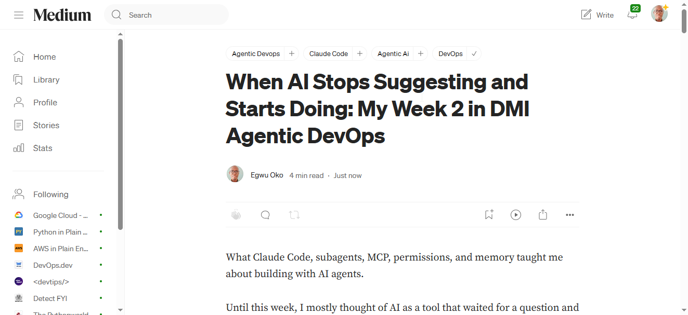
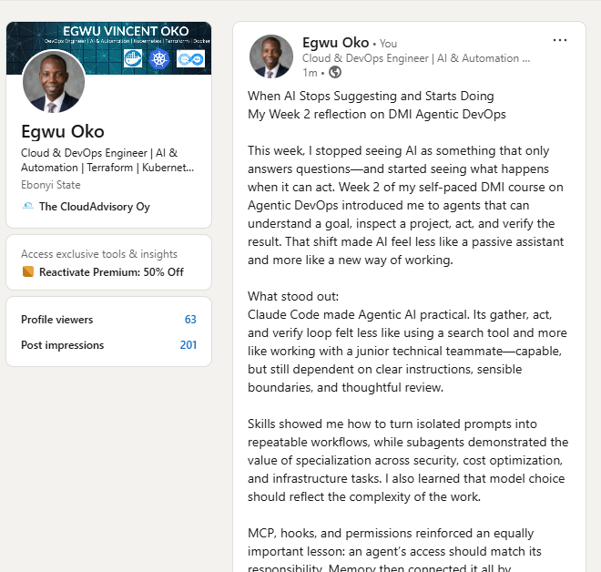

# Assignment 8 — Week 2 Reflection Blog

Part of the DevOps Micro Internship (DMI) Cohort 3 with Agentic AI

---

# Purpose

In this assignment, you will reflect on your Week 2 learning journey and write a short blog capturing your experience working with Agentic AI tools such as Claude Code, Skills, Subagents, MCP, Hooks, Permissions, and Memory.

You will also publish a LinkedIn post summarizing your learning and share both links for evaluation.

---

# Task 1 — Write Your Reflection Blog

## Goal

Write a reflection blog covering your Week 2 learning experience.

### Blog Requirements

Your blog must include:

* Title: **Reflection – Week 2**
* Minimum 300 words
* At least 2–3 topics from Week 2 (Claude Code, Skills, Subagents, MCP, Hooks, Permissions, Memory)
* Honest personal reflection (learning, challenges, mindset)
* One habit/system you plan to implement
* Your full name clearly visible

### Allowed Platforms

You can publish your blog on:

* Hashnode
* Medium
* Dev.to
* LinkedIn Article
* GitHub Markdown file
* Substack

---

### Evidence

#### Screenshot 1 — Blog published and visible



---

### Submission Field

Blog Link:

`https://medium.com/@egwuoko76/when-ai-stops-suggesting-and-starts-doing-my-week-2-in-agentic-devops-5c0e5f0efec8`

---

# Task 2 — Create LinkedIn Post

## Goal

Share your Week 2 learning publicly on LinkedIn.

---

### LinkedIn Post Requirements

Your post must include:

* One screenshot from any Week 2 assignment
* Short reflection (what you learned or built)
* Required P.S. line exactly as given below

---

### Required P.S. Line (Must Include Exactly)

> **P.S. This post is part of the DevOps Micro Internship (DMI) with Agentic AI — Cohort 3 — by [Pravin Mishra](https://www.linkedin.com/in/pravin-mishra-aws-trainer/). My graded progress is public: https://dmi.pravinmishra.com/s/YOUR-GITHUB-USERNAME.html · Start your DevOps journey: https://dmi.pravinmishra.com/?utm_source=student&utm_medium=ps-linkedin&utm_campaign=cohort3**

---

### Suggested Hashtags

#DMIByPravinMishra #AgenticAI #ClaudeCode #DevOps #LearningInPublic

---

### Evidence

#### Screenshot 2 — LinkedIn post published



---

### Submission Field

LinkedIn Post Content (copy-paste here):

```
When AI Stops Suggesting and Starts Doing
My Week 2 reflection on DMI Agentic DevOps

This week, I stopped seeing AI as something that only answers questions—and started seeing what happens when it can act. Week 2 of my self-paced DMI course on Agentic DevOps introduced me to agents that can understand a goal, inspect a project, act, and verify the result. That shift made AI feel less like a passive assistant and more like a new way of working.

What stood out:
Claude Code made Agentic AI practical. Its gather, act, and verify loop felt less like using a search tool and more like working with a junior technical teammate—capable, but still dependent on clear instructions, sensible boundaries, and thoughtful review.

Skills showed me how to turn isolated prompts into repeatable workflows, while subagents demonstrated the value of specialization across security, cost optimization, and infrastructure tasks. I also learned that model choice should reflect the complexity of the work.

MCP, hooks, and permissions reinforced an equally important lesson: an agent’s access should match its responsibility. Memory then connected it all by preserving project decisions and lessons across sessions.

What I learned about myself:
I learn best by doing. Working directly with terminal commands has increased my confidence, and one proud moment I will not easily forget was fixing an error simply by slowing down and reading the output carefully.

My biggest takeaway is simple: Agentic DevOps does not remove engineering responsibility—it raises the standard for it. The more an agent can do, the more intentional I must be about goals, access, review, and verification.

Agentic AI is not valuable simply because it can act; it becomes valuable when we design those actions with purpose, context, and control. I am leaving Week 2 more confident, more curious, and more willing to learn by doing. 

I remain grateful to Pravin Mishra.

What has helped you become more comfortable working with AI agents?

P.S. This post is part of the DevOps Micro Internship (DMI) — Self-Paced Engineer Track — by Pravin Mishra. My graded progress is public: https://lnkd.in/e_AT7QxG · Start your DevOps journey: https://lnkd.in/eQXMUNpV

#DMIByPravinMishra #AgenticAI #ClaudeCode #DevOps #LearningInPublic
```

---

### LinkedIn Post Link:

`https://lnkd.in/p/eYerwv_P`

---

# Submission Instructions

* Blog must be publicly accessible
* LinkedIn post must be visible (public or unlisted where applicable)
* All required fields must be filled
* Screenshot proofs must be added to GitHub repository
* Do not include sensitive information in blog or post

---

# Completion Checklist

* [ ] Blog written with required structure
* [ ] Blog includes at least 2–3 Week 2 topics
* [ ] Blog is publicly accessible
* [ ] LinkedIn post created
* [ ] Required P.S. line included
* [ ] LinkedIn post content copied in submission field
* [ ] Blog link added
* [ ] LinkedIn post link added
* [ ] Screenshots added to GitHub repo

---

# About DMI & CloudAdvisory

DevOps Micro Internship (DMI) is a project-based DevOps program run by Pravin Mishra (The CloudAdvisory), focused on real-world execution, systems thinking, and agentic AI workflows.

It helps learners build strong DevOps foundations through hands-on experience.

---

# Resources

* 🌐 DMI Official Website: [https://dmi.pravinmishra.com?utm_source=github&utm_medium=readme](https://dmi.pravinmishra.com?utm_source=github&utm_medium=readme)
* 🎓 University: [https://university.pravinmishra.com?utm_source=github&utm_medium=readme](https://university.pravinmishra.com?utm_source=github&utm_medium=readme)
* 💬 Discord Community: [https://discord.pravinmishra.com?utm_source=github&utm_medium=readme](https://discord.pravinmishra.com?utm_source=github&utm_medium=readme)
* 📝 Blog: [https://dmi.pravinmishra.com/blog?utm_source=github&utm_medium=readme](https://dmi.pravinmishra.com/blog?utm_source=github&utm_medium=readme)
* ▶️ YouTube Playlist: [https://www.youtube.com/playlist?list=PLFeSNDtI4Cho](https://www.youtube.com/playlist?list=PLFeSNDtI4Cho)
* 🔗 Pravin Mishra (LinkedIn): [https://www.linkedin.com/in/pravin-mishra-aws-trainer/](https://www.linkedin.com/in/pravin-mishra-aws-trainer/)
* 🏢 CloudAdvisory (LinkedIn): [https://www.linkedin.com/company/thecloudadvisory/](https://www.linkedin.com/company/thecloudadvisory/)

